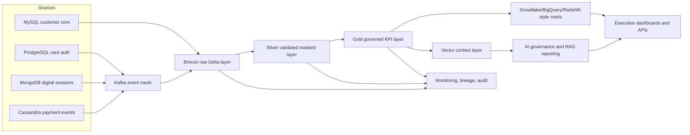
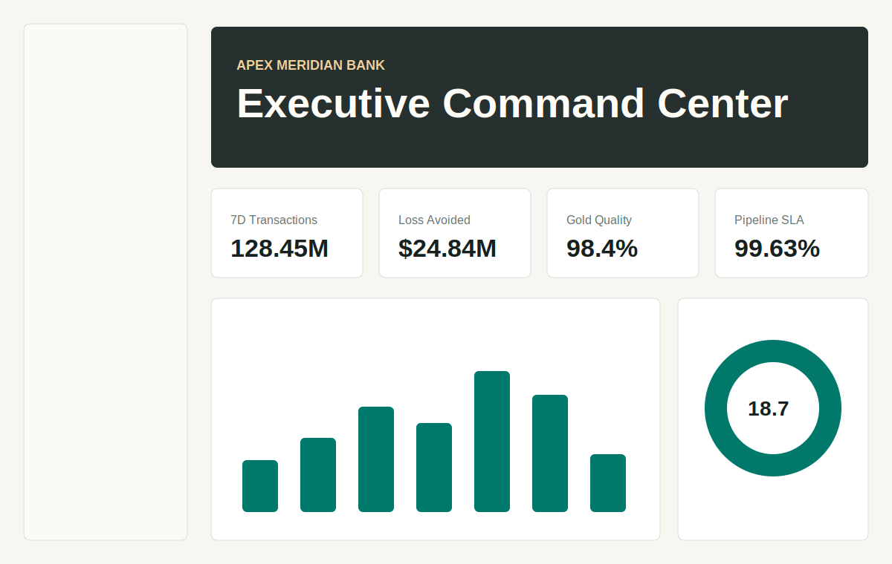
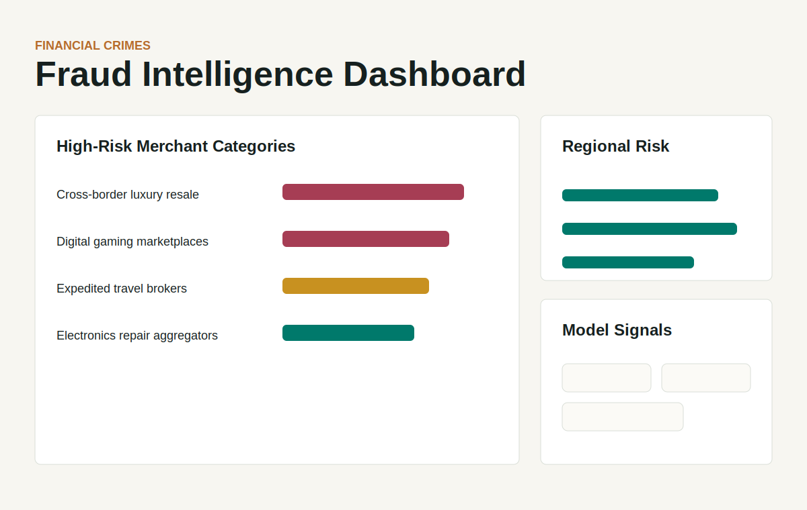
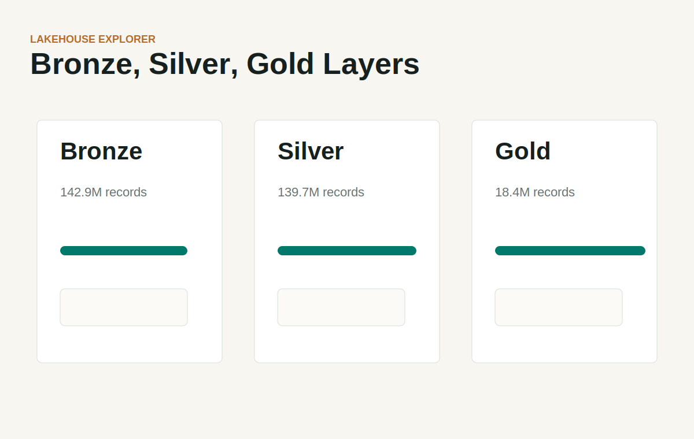

# Apex Meridian Bank Intelligence Platform

**Apex Meridian Bank Intelligence Platform** is an original enterprise banking data engineering project for lakehouse analytics, fraud intelligence, customer risk, regulatory reporting, and governed AI reporting. It models a premium financial institution data platform with real code, synthetic high-scale data generation, dashboards, APIs, orchestration, ML scoring, governance controls, deployment assets, and recruiter-friendly documentation.

The platform is designed to support **500M+ simulated banking records** without storing massive static files in the repository. Local sample data is small; large workloads are produced on demand in configurable batches.

## Business Problem

Modern banking teams need trusted, governed, and explainable data products across card transactions, customer profiles, merchant behavior, loan payments, fraud alerts, chargebacks, rewards, and regulatory KPIs. Apex Meridian demonstrates how those domains flow from operational systems and Kafka streams into Bronze, Silver, and Gold lakehouse layers, then into executive dashboards and cited AI answers.

## Platform Capabilities

- Batch, CDC-style, and streaming ingestion patterns for banking source systems.
- Bronze immutable raw landing, Silver validated data, and Gold governed analytics marts.
- Synthetic data generators for 1M, 10M, 100M, and 500M+ record simulations.
- Data quality scorecards, PII masking, RBAC policies, lineage, retention, and audit logs.
- Fraud anomaly scoring, transaction risk features, and customer behavior clustering.
- Governed RAG chatbot that answers only from Gold metrics and approved metadata.
- Executive report generation with metric validation and citations.
- Premium enterprise web app for command center, fraud, customer, pipelines, lakehouse, AI governance, reports, lineage, quality, and audit.
- Docker Compose, Kubernetes manifests, GitHub Actions, and Jenkins pipeline.

## Architecture Summary



## Technology Stack

Python, SQL, PySpark, Apache Spark, Apache Kafka, Apache Airflow, Delta Lake-style logs, PostgreSQL, MySQL, MongoDB, Cassandra, S3-compatible storage, Azure Data Lake-compatible paths, Google Cloud Storage-compatible paths, Snowflake-style marts, BigQuery-style analytics, Redshift-style reporting, Docker, Kubernetes, GitHub Actions, Jenkins, RAG, vector search, ML anomaly detection, PII masking, RBAC, lineage, audit logging, and FastAPI.

## Folder Structure

```text
apps/backend/            FastAPI APIs for KPIs, fraud, chatbot, reports, governance, lineage
frontend/                Premium static enterprise web application
src/apex_meridian/       Reusable data platform, ML, RAG, governance, reporting modules
pipelines/airflow/       Airflow DAGs
pipelines/spark/         PySpark lakehouse and fraud feature jobs
pipelines/kafka/         Kafka topic spec, producer, checkpoint validator
pipelines/sql/           Warehouse DDL and marts
data/sample/             Small sample metrics and audit data
data/reference/          Data catalog, RBAC policies, sample merchants
data/lakehouse/          Local Bronze/Silver/Gold landing structure
infrastructure/          Docker, Kubernetes, and deployment assets
diagrams/                Mermaid architecture and lineage diagrams
docs/screenshots/        Original dashboard preview assets
tests/                   Unit tests for generation, quality, and governed chatbot
outputs/                 User-facing generated reports
```

## Data Flow

1. Operational sources emit customer, account, card authorization, loan, payment, rewards, and fraud events.
2. Kafka topics land real-time event domains such as `card.transactions.raw`, `fraud.alerts.raw`, and `audit.events`.
3. Batch and CDC-style ingest jobs land immutable raw records into Bronze.
4. Silver jobs validate schemas, remove duplicates, enforce null rules, mask PII, and enrich with risk bands.
5. Gold jobs publish governed KPIs for fraud trends, Customer 360, data quality, chargebacks, pipeline SLAs, and executive reporting.
6. Warehouse marts serve executive dashboards and regulatory reporting.
7. Approved Gold metadata is indexed into a vector context layer for cited RAG answers.
8. AI answers and reports are validated, cited, RBAC-checked, and audit logged.

## Bronze, Silver, Gold

- **Bronze** stores immutable raw records and Kafka payloads with partitioning by event date and ingestion date.
- **Silver** stores deduplicated, typed, masked, and quality-checked banking entities.
- **Gold** stores governed KPI tables, dimensional marts, regulatory aggregates, and AI-approved context.
- Delta-style `_delta_log` commit files are emitted by local utilities and represented by Spark jobs for production usage.
- Retention: Bronze 730 days, Silver 365 days, Gold 2555 days for regulatory KPI history.
- Time travel: Delta logs allow historical table versions to be restored or compared by commit version.

## Kafka Topics

Defined in [pipelines/kafka/topics.yaml](pipelines/kafka/topics.yaml):

- `card.transactions.raw`
- `merchant.events.raw`
- `customer.profile.updates`
- `fraud.alerts.raw`
- `payment.events.raw`
- `rewards.events.raw`
- `ai.report.requests`
- `audit.events`

## Airflow DAGs

[pipelines/airflow/dags/apex_meridian_platform_dag.py](pipelines/airflow/dags/apex_meridian_platform_dag.py) includes tasks for:

- Daily batch ingestion
- Real-time stream checkpoint validation
- Bronze-to-Silver transformation
- Silver-to-Gold transformation
- Data quality validation
- Fraud model scoring
- AI report generation
- Governance audit export
- Warehouse synchronization

## Data Model

Core domains:

- Credit card transactions
- Customer profiles
- Merchant activity
- Account balances
- Loan payments
- Fraud alerts
- Chargebacks
- Rewards activity
- Risk scores
- Regulatory reporting
- Weekly executive risk reporting
- Customer 360 analytics

Warehouse examples live under [pipelines/sql](pipelines/sql), including `silver.card_transactions`, `gold.fraud_daily_kpis`, `gold.data_quality_scorecards`, and `warehouse.executive_risk_mart`.

## Synthetic Data Scale

Generate local demo data:

```bash
PYTHONPATH=src python -m apex_meridian.data_generation.generator --records 5000 --batch-size 1000 --domains all --output data/generated/local_demo
```

Generate larger simulations:

```bash
PYTHONPATH=src python -m apex_meridian.data_generation.generator --records 1000000 --batch-size 100000 --domains transactions --output data/generated/1m
PYTHONPATH=src python -m apex_meridian.data_generation.generator --records 10000000 --batch-size 250000 --domains transactions,fraud_alerts --output data/generated/10m
PYTHONPATH=src python -m apex_meridian.data_generation.generator --records 100000000 --batch-size 1000000 --domains transactions --output /data/apex/generated/100m
PYTHONPATH=src python -m apex_meridian.data_generation.generator --records 500000000 --batch-size 1000000 --domains transactions --output /data/apex/generated/500m
```

For 100M and 500M+ runs, use distributed storage and Spark ingestion rather than a laptop filesystem.

## AI/RAG Architecture

The governed chatbot is implemented in [src/apex_meridian/rag](src/apex_meridian/rag). It:

- Indexes approved Gold metrics and metadata only.
- Refuses unsupported questions and names the missing dataset requirement.
- Returns citations such as `gold.fraud_daily_kpis` and `warehouse.executive_risk_mart`.
- Emits audit identifiers for each answer.
- Uses prompt versioning via `PROMPT_VERSION`.
- Supports hallucination controls by requiring retrieved governed context before response generation.

## ML Explanation

[src/apex_meridian/ml/fraud_model.py](src/apex_meridian/ml/fraud_model.py) provides deterministic anomaly scoring with reason codes. Spark feature engineering in [pipelines/spark/fraud_feature_job.py](pipelines/spark/fraud_feature_job.py) builds features such as amount log, velocity bucket, alert score, and confirmed fraud label. Customer clustering is represented in [src/apex_meridian/ml/customer_clustering.py](src/apex_meridian/ml/customer_clustering.py).

## Governance and Security

- PII masking and tokenization for direct identifiers.
- RBAC role-to-dataset policy in [data/reference/rbac_policies.json](data/reference/rbac_policies.json).
- Audit trail for Airflow, APIs, and AI-generated answers.
- Data catalog with approved AI usage flags.
- Quality scorecards for freshness, completeness, validity, and failed rules.
- Retention policy by lakehouse layer.
- AI answer refusal for unapproved or unindexed topics.

## Local Setup

```bash
python -m venv .venv
source .venv/bin/activate
python -m pip install -r requirements.txt
PYTHONPATH=src:. python -m pytest -q
```

Run the API:

```bash
PYTHONPATH=src:. uvicorn apps.backend.app.main:app --host 0.0.0.0 --port 8080 --reload
```

Run the frontend:

```bash
python -m http.server 8088 --directory frontend
```

Open `http://localhost:8088`.

## Docker Setup

```bash
docker compose up --build backend frontend postgres kafka zookeeper minio
```

Optional Airflow:

```bash
docker compose --profile orchestration up --build airflow
```

## Kubernetes Setup

```bash
docker build -f apps/backend/Dockerfile -t apex-meridian-api:local .
docker build -f frontend/Dockerfile -t apex-meridian-frontend:local .
kubectl apply -k infrastructure/kubernetes/overlays/local
```

## CI/CD

- GitHub Actions installs dependencies, runs tests, generates smoke data, and builds images.
- Jenkinsfile runs dependency installation, unit tests, synthetic data smoke generation, and image builds.
- Kubernetes manifests define API replicas, frontend replicas, config maps, services, and a governance export CronJob.

## Screenshots

Original dashboard preview assets:





The live frontend provides the full interactive version under [frontend/index.html](frontend/index.html).

## Resume Bullet Points

- Built an enterprise banking lakehouse platform with Kafka ingestion, PySpark Delta-style Bronze/Silver/Gold processing, Airflow orchestration, and warehouse marts for executive risk analytics.
- Designed scalable synthetic financial data generators supporting 500M+ record simulations without committing large datasets to source control.
- Implemented governed AI/RAG reporting with Gold-only retrieval, citation enforcement, prompt versioning, refusal logic, RBAC-aware metadata, and answer audit trails.
- Created fraud anomaly scoring, customer risk segmentation, data quality scorecards, PII masking, lineage, audit logging, Docker/Kubernetes deployment, and CI/CD workflows.
- Delivered a premium executive dashboard covering fraud intelligence, Customer 360, pipeline monitoring, lakehouse exploration, AI governance, report generation, lineage, quality, and audit views.

## Recruiter-Friendly Summary

Apex Meridian Bank Intelligence Platform is a complete original banking data engineering portfolio project demonstrating large-scale data pipelines, real-time streaming, lakehouse architecture, cloud-platform-compatible storage patterns, data governance, ML fraud intelligence, AI-governed reporting, dashboard engineering, CI/CD, and containerized deployment.

